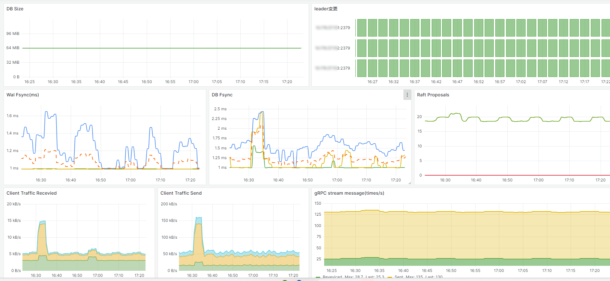
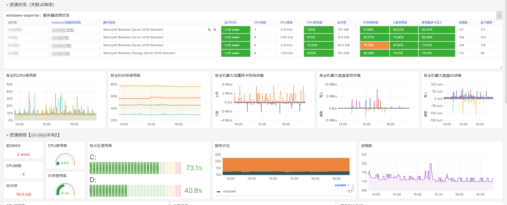

# grafana-dashboard-example

## Info

* DataSource：Prometheus
* you can visit my grafana dashboards by: https://grafana.com/orgs/oran/dashboards

## ETCD

.
├── etcd.json

Dashboard ID: 20790

## Windows Exporter
.
├── windows_exporter.json

Dashboard ID: 20865

copy from 10467，优化显示，磁盘显示项排除以HarddiskVolume开头的磁盘信息。

